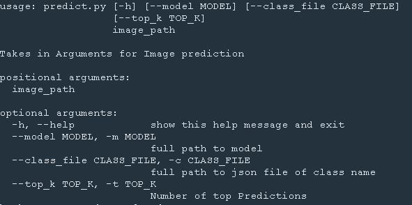
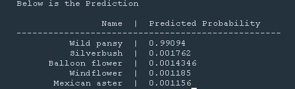

# TensorFlow Image Classifier
In this project an image classifier is built using tensorflow, First a deep learning model was built by customising `ImageNet` network and an output layer was added to classify 102 different classes of Flowers, Then a python module [`predict.py`](./predict.py) was built as a commandline application to accept a flower image, print top n prediction probabilities (n=5 as default) also return the dictionary with the predicted name.

## Usage




### Usage Example

```
python predict.py ./test/images/wild_pansy.jpg \
  --model ./model_1657087576.h5 \
  --class_file ./label_map.json \
  --top_k 5
```
When only the positional argument (image_path) is supplied, e.g only `./test/images/wild_pansy.jpg` then the default is used as in the above usage example

#### sample input
 
#### sample output


